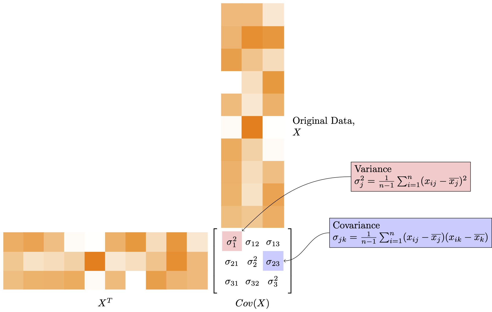
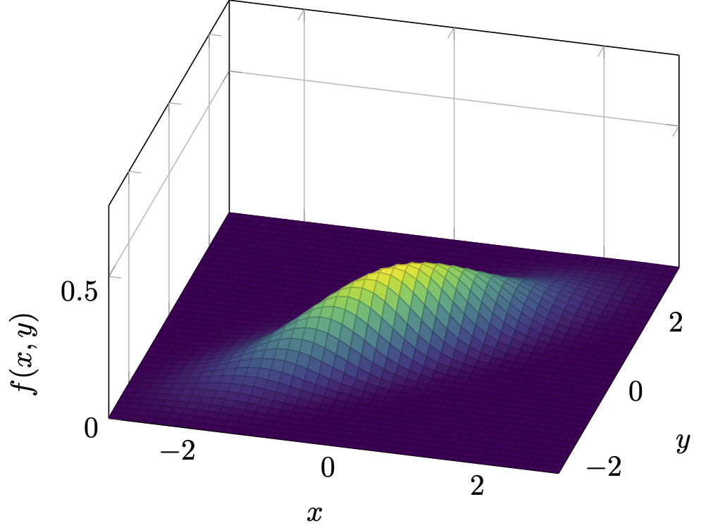

# PrincipalComponentAnalysis

An HTML handout on principal component analysis powered by R Markdown and TikZ diagrams. 

Link: https://ctesta01.github.io/PrincipalComponentAnalysis/

*******

I am super proud of the figures I was able to create in TikZ!  Here's some examples: 

#### An infographic explaining the covariance matrix

#### A 3D diagram showing the density of a bivariate normal distribution

#### TikZ References

For the most part, I used a lot of the same references as I used in my [ecosocial theory tikz](https://github.com/ctesta01/ecosocial_theory_tikz) project, but
there are a couple more that are unique to this: 

  - 3D diagrams <https://tikz.dev/library-3d>
  - Matrices <https://tikz.dev/tikz-matrices>
  - Database table style formatting for tables <https://tex.stackexchange.com/questions/134821/drawing-database-tables-in-tikz>
  - Marginal histograms <https://tex.stackexchange.com/questions/193059/scatterplot-with-marginal-histograms-using-pgfplots>
