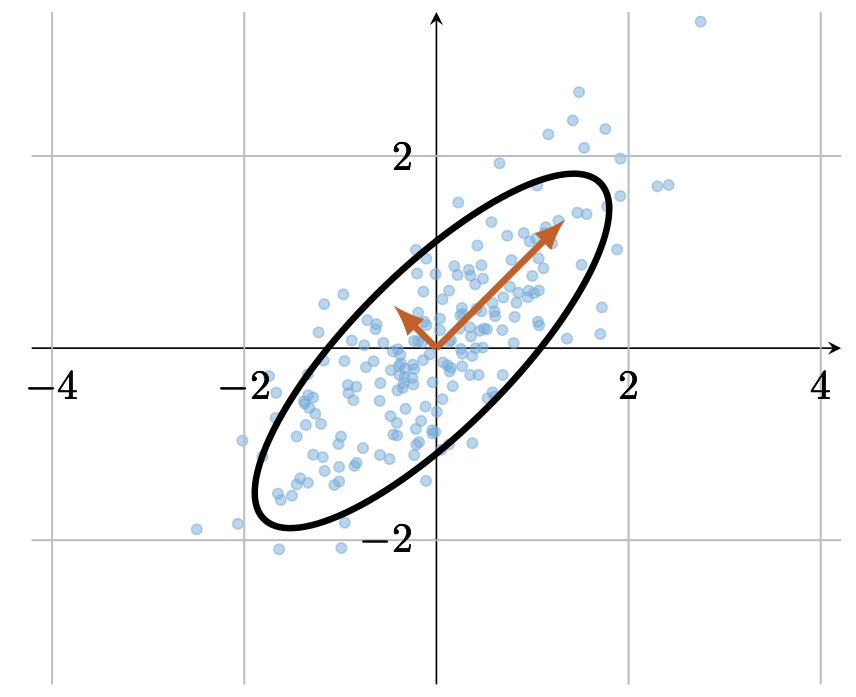
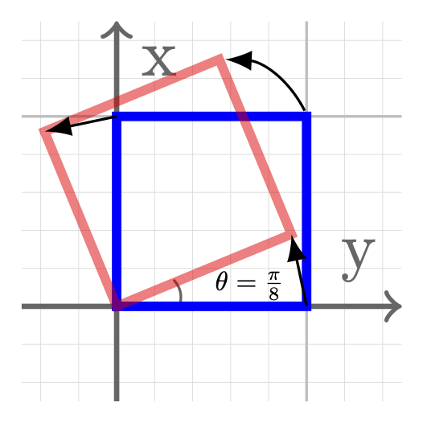
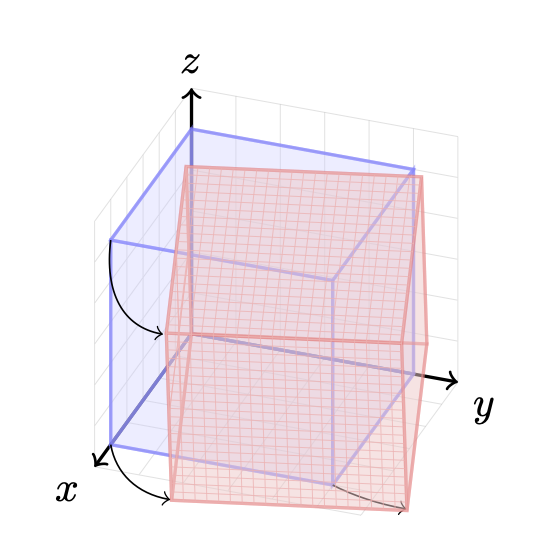

# Introduction 

```{tikz, fig.cap = "This data matrix above shows an example of some data that we might want to perform PCA on. The subsequent scatterplot is accompanied by marginal histograms that show the distribution of the data in the $x$ and $y$ dimensions. Note the high amount of correlation.", fig.ext = 'png', fig.margin = TRUE, echo=FALSE}

\begin{tikzpicture}[my matrix/.style={
  draw, matrix of nodes,
  nodes={
      minimum width=1.05cm,
      inner xsep=+.5\tabcolsep, inner ysep=+0pt, align=left},
    inner sep=.5\pgflinewidth,
    font=\strut\ttfamily,
    row 1/.style={nodes={fill=red!20}},
  }
]
\matrix[my matrix] (m) at (0, 0) {
  x & y \\
  .53 & .75  \\
  -.42 & .05 \\
  .26 & -.49 \\
  \vdots & \vdots \\
};

\node [above] at (m.north) {Original Data};

\node [shift={(0,-4.5cm)}] at (0,0) {\includegraphics[width=4.8cm]{figures/matrix_and_scatter/standalone_scatter_with_marginal_histograms.pdf}};  % Adjust coordinates and dimensions as needed
\end{tikzpicture}
```

Principal Component Analysis (PCA) @wikiPCA is a technique comprised of transforming the 
given data into a new coordinate system where most of the variation can be 
described using fewer dimensions than the initial data. The principal components are defined to be the eigenvectors of the data's covariance matrix, and thus the principal components are often computed by eigendecomposition of the data
covariance matrix. PCA can be thought of as fitting a $p$-dimensional ellipsoid to the data where each axis of the ellipsoid represents a principal component where $p$ is the dimension of the data covariance matrix.  

Because the principal components are identified in the order in which they explain 
the most variance to least variance, projecting the original dataset onto the subset of 
principal components 1 through $n$ (where $n$ is less than $p$) allows the practitioner to perform what is called "dimension reduction" on the data. 

```{r fig.cap = "Part of the process of PCA is to identify the axes in which the data vary starting with the axis of greatest variation and proceeding to axes where the data vary less. This can be thought of as defining an ellipse (or ellipsoid) by its major and minor axes which contains most of the data.", echo=F, fig.margin=TRUE}

```

```{r echo=FALSE, fig.margin=TRUE, fig.cap="A multivariate (bivariate) normal distribution."}
knitr::include_graphics("figures/bivariate_normal/bivariate_normal.png")
```

```{css, echo=FALSE}
pre {
    background: #fff !important;
    border: 1px solid #ddd !important;
    border-color: #000 !important;
    padding: 15px;
    border-radius: 20px;
}
:::

```{r, echo=TRUE, eval=FALSE}
# Load required library
library(MASS)

# set parameters
mu <- c(0, 0) # mean in X,Y space
# define our covariance matrix
Sigma <- matrix(c(1, 0.8, 0.8, 1), 2) 
num.samples <- 200

# Generate data
set.seed(123)
# sample a random multivariate random normal
data <- mvrnorm(num.samples, mu, Sigma) 

# running PCA in R is easy with prcomp
prcomp(data) 
#> Standard deviations (1, .., p=2):
#> [1] 1.2654504 0.4451943
#> 
#> Rotation (n x k) = (2 x 2):
#>            PC1        PC2
#> [1,] 0.7149319  0.6991941
#> [2,] 0.6991941 -0.7149319

# these results match the results of 
# eigendecomposition on the covariance matrix — 
# this works since the data are already centered
eigen(cov(data))
#> eigen() decomposition
#> $values
#> [1] 1.601365 0.198198
#> 
#> $vectors
#>            [,1]       [,2]
#> [1,] -0.7149319  0.6991941
#> [2,] -0.6991941 -0.7149319

# lastly, note that eigendecomposition can be
# done efficiently using svd 
svd(cov(data))
#> $d
#> [1] 1.601365 0.198198
#> 
#> $u
#>            [,1]       [,2]
#> [1,] -0.7149319 -0.6991941
#> [2,] -0.6991941  0.7149319
#> 
#> $v
#>            [,1]       [,2]
#> [1,] -0.7149319 -0.6991941
#> [2,] -0.6991941  0.7149319
```


# Covariance 

```{r echo=FALSE, fig.fullwidth=TRUE, fig.cap="The structure of the covariance matrix is one where the $ij$th entry is defined by the covariance of $X_i$ and $X_j$. In the instance where $i=j$, then the entry in the $ij$th position is the variance of $X_i$."}
knitr::include_graphics("figures/covariance/covariance.png")
```

# Spectral Decomposition Theorem


The spectral theorem is a key result in linear algebra, which states that a symmetric matrix can be diagonalized by a basis of its eigenvectors. Specifically, for a real symmetric matrix $A$, there exists an orthogonal matrix $P$ such that the matrix $P^{T}AP = D$ is a diagonal matrix. The entries on the diagonal of $D$ are the eigenvalues of $A$, and the columns of $P$ are the corresponding eigenvectors.

This theorem can be proved by induction on the dimension of $A$. The base case (for $1 \times 1$ matrices) is trivial. For the induction step, one can find an eigenvector $v$ of $A$ and extend it to an orthonormal basis of the vector space. It can then be shown that the matrix of $A$ with respect to this basis has a block diagonal form, which allows us to apply the induction hypothesis.

This diagonalization process has many applications in various fields including physics, engineering, and computer science, as it simplifies many calculations and enables numerical algorithms.

# Rotation Matrices 

```{r fig.margin=TRUE, echo=FALSE, fig.cap="Part of why rotation matrices work is that their determinant is 1, meaining the generalized-volume of the unit-square/cube/hypercube transformed by a rotation matrix is still 1. "}

```

```{marginfigure}
This arises in the 2D case from the fact that $$\cos^2 \theta + \sin^2 \theta = 1.$$
```

A rotation matrix is a matrix that performs a rotation in Euclidean space. For 2-dimensional space, a rotation matrix that rotates a vector through an angle $\theta$ counter-clockwise is given by
$$ R(\theta) = \begin{bmatrix} \cos \theta & \sin \theta \\ -\sin \theta & \cos \theta \end{bmatrix}.$$

```{r fig.margin=TRUE, echo=FALSE, fig.cap="3D rotation matrices aren't really that much more complicated. They're constructed from multiplications of rotation matrices designed to rotate about each axis. Typically the easiest way is to construct three matrices $R_X$, $R_Y$, and $R_Z$ using formulas similar to the 2D rotation matrix structure that define the amount of rotation along each axis and then multiply them together to get the resultant 3D rotation matrix."}

```


In 3-dimensional space, rotation matrices are more complex and depend on the axis of rotation.

The key property of rotation matrices is that they are orthogonal: the transpose of a rotation matrix is also its inverse. This means that rotations preserve the dot product, so they preserve lengths and angles, making them crucial in geometry, physics, and computer graphics.


# Singular Value Decomposition 

The singular value decomposition is a generalization of the spectral theorem that applies to any $m \times n$ matrix $A$. The SVD states that $A$ can be written as

$$A = U \Sigma V^T$$

where $U$ is an $m \times m$ orthogonal matrix, $V$ is an $n \times n$ orthogonal matrix, and $\Sigma$ is an $m \times n$ diagonal matrix. The diagonal entries of $\Sigma$ are the singular values of $A$, and the columns of $U$ and $V$ are the left-singular vectors and right-singular vectors of $A$, respectively.

The singular value decomposition can be computed using a two-step process:

******
**Algorithm 1**:  Singular Value Decomposition (SVD)

******
Procedure SVD($A$):

1.  <div style='margin-left: 25px;'>Compute the eigendecomposition of $A^{T}A$: $A^{T}A = V \Lambda V^{T}$</div>
2.  <div style='padding-left: 25px;'>Set $\Sigma$ to be the square root of the eigenvalues in $\Lambda$ (in decreasing order)</div>
3.  <div style='padding-left: 25px;'>Compute $U$ by normalizing the columns of $AV\Sigma^{-1}$</div>
4.  <div style='padding-left: 25px;'>Return $U$, $\Sigma$, $V$</div>

******

This process is widely used in various fields including machine learning, data compression, and numerical linear algebra due to its robustness and ability to provide geometric insights about the transformation represented by $A$.


